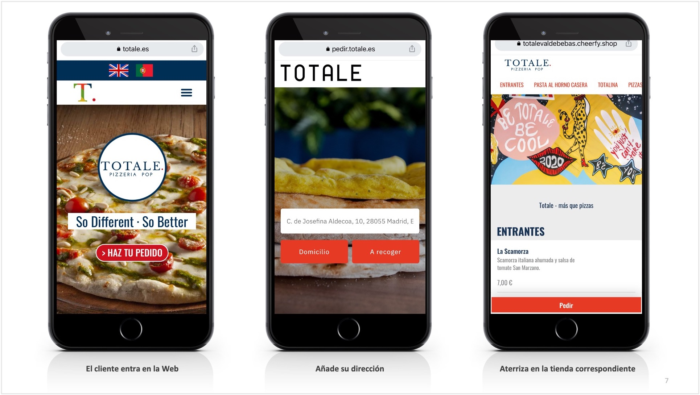
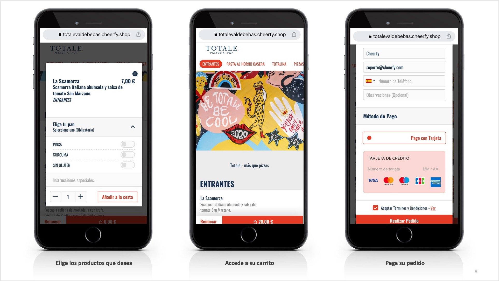

# Forma a tus Empleados

## Introducción

### Viaje del cliente

### Ecosistema

.png>)

## Servicios y horarios

* Recogidas - pedidos de Take Away o para recoger en tienda.
* Entregas - pedidos a domicilio.
* Cenas - pedidos producidos en el restaurante.

### 3 tipos de servicio

.png>)

#### 1. Recogidas

Pedidos de Take Away o para recoger en tienda.

**Parámetros clave**:

#### 2. Entregas

Pedidos a domicilio.

**Parámetros clave**:

#### 3. Cenas

Pedidos realizados en el restaurante.

**Parámetros clave**:


Acuérdate de darle a guardar cada vez que edites.


### Configuración de servicios disponibles

#### Delivery y Take Away:

Landing Page

Pausar / reactivar servicios

#### Sala:

### Horario

#### Localización

#### Servicios

#### Menús

## Menú

### Integrado con agregador / TPV


Tus menús de Cheerfy Shop se actualizan de forma centralizada desde el agregador / TPV. Los cambios que realices en ellos, una vez publicados, se reflejarán automáticamente en Cheerfy Shop.


#### Disponibilidad de productos

#### Ordenación de grupos modificadores


Los modificadores de los productos de tu menú se ordenarán incluyendo **primero los obligatorios** (a su vez ordenados alfabéticamente) y **después los opcionales** (a su vez ordenados alfabéticamente).


#### Filtros del menú: horarios, servicio


Podrás filtrar tus menús en base a un horario específico de cada cual, o del tipo de servicio al que estén destinados: a domicilio, a recoger, en sala.


* **Filtrado en base al horario**

****

#### Etiquetas

### Manual

## Promociones

### Códigos de promoción

### Cupones individuales

## Recepción de pedidos

### Integración: Inmediatos Vs programados

### Cheerfy

### Impresoras

### Email

## Pagos

### Stripe Connect

### Stripe Standard

### Fuera del local

## Transportistas

### Integración

### Matriz de priorización

### Cómo cancelar

## Crear empleados

1. En el panel principal de Cheerfy Shop (antes de seleccionar restaurante), selecciona la opción "Staff" del menú de arriba.&#x20;
2. Haz click en "Create Staff".
3. Asigna las credenciales y permisos del empleado en cuestión.

.png>)

## Varios

### Datos clave

### Recibos

### Página de confirmación

### IVA

### Propina

## Cancelación de Pedidos

1. Selecciona la opción "Orders" en el menú lateral izquierdo.
2. Selcciona el pedido que deseas cancelar.
3. Pulsar el botón "Cancel". (También es posible realizar la cancelación pulsando en "Details" - "Change Status" - "Cancelled").
4. El pedido irá a la sección de "Cancelled".


Si un cliente desease cancelar su pedido deberá contactar con el local (dispone en los T\&C’s de vuestro correo para contactaros) y será el local quien deba cancelarlo.


.png>)

## Devolución de Pedidos

1. Selecciona la opción "Orders" en el menú lateral izquierdo.
2. Selecciona el pedido cancelado en la cajita "Cancelled" para realizar la devolución en el botón "Details".
3. Pulsar el botón desplegable "Actions".
4. Pulsar en la opción "Refund Stripe Payment". (Esto reembolsará todo el importe).
5. Se puede hacer un reembolso parcial desde la cuenta de Stripe, seleccionando el pedido e introduciendo la cantidad que se desea devolver.

.png>)

### Devolución de Pedididos Parciales


Como mencionábamos en el paso anterior, si hiciese falta reembolsar un pedido parcialmente, lo haríamos directamente desde Stripe.


1. Dentro de Stripe, ir a la opción "Pagos" en el menú lateral izquierdo y seleccionar el pago a reembolsar.
2. Haz click en el botón de arriba a la derecha "Reembolsar".
3. Se nos abrirá una ventana donde podemos seleccionar el importe del reembolso y el motivo.

.png>)

## Retrasar Estimación de Pedidos

1. Selecciona la opción "Orders" en el menú lateral izquierdo.
2. Selecciona el pedido al que deseas retrasar la estimación de preparación, y pulsa el botón "Details".
3. Pulsa el botón "Set. Est. Ready Time" para añadir los minutos necesarios en la estimación de preparación del pedido.

.png>)

## Gestión del Stock y Disponibilidad de Productos

1. Selecciona la opción "Menus" en el menú lateral izquierdo.
2. Selecciona la opción "Menus" en el menú superior.
3. Despliega los menús y categorías hasta seleccionar el producto deseado.
4. Selecciona la acción deseada.


**Posibles acciones**:

1. "Cancel" = Cancelar selección.
2. "Available" = Marcar producto como disponible.
3. "No Stock" = Marcar producto sin stock.
4. "Hide" = Esconder producto.
5. "Delete" = Borrar producto.


.png>)

## Crear Menús / Categorías / Platos

1. Selecciona la opción "Menus" en el menú lateral izquierdo.
2. Selecciona la opción "Menus" en el menú superior.
3. Despliega los menús y categorías.&#x20;
4. Selecciona la acción deseada.


**Posibles acciones**:

1. "Create New Dish" = Crear nuevo plato.
2. &#x20;"Create New Category" = Crear nueva categoría.
3. &#x20;"Create New Menu" = Crear nuevo menú.
4. &#x20;"Re-arrange" = Ordenar.


.png>)

## Editar Menús

1. Selecciona la opción "Menus" en el menú lateral izquierdo.
2. Selecciona la opción "Menus" en el menú superior.
3. Despliega los menús y categorías hasta seleccionar el producto deseado.
4. Pulsa la acción "Edit" a la derecha, y en la pantalla que se abre, edita los campos deseados.


**Posibles campos a editar**:

1. "Name" = Nombre.
2. "Price" = Precio.
3. "Description" = Descripción. (Recomendamos usar este campo para añadir alérgenos a cada plato).
4. "Subtitle" = Subtítulo. (Recomendamos usar este campo para añadir las descripciones de los platos).


.png>)

