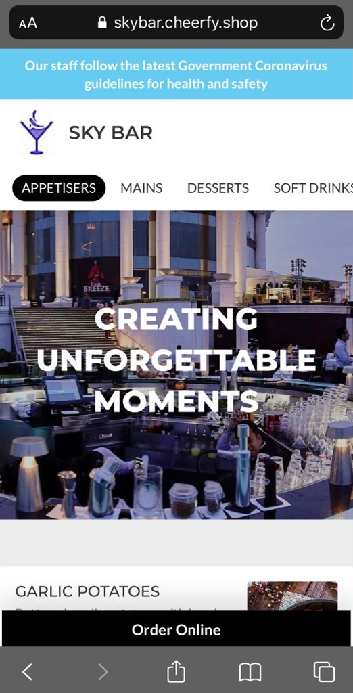
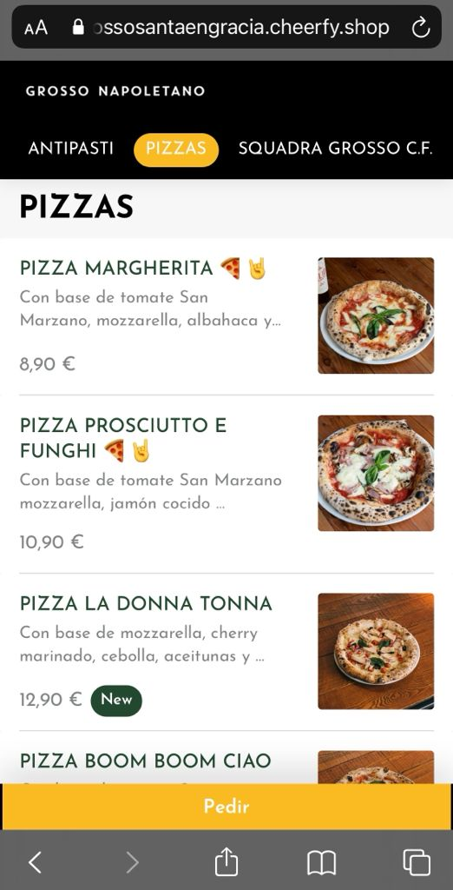

# Diseño

## Cómo personalizar tu diseño

> _Encuéntralo en "Settings" - "Website" - "Design" - "Open Design Mode"_

Elije tus colores corporativos, tipo de letra, imágenes y demás aspectos personalizables para cada una de las partes de tu tienda online.

## Dimensiones recomendadas para las fotos

* Logo - 300 pixels de ancho por 100 pixels de alto
* Header - 1920 pixels de ancho por 500 de alto
* Logo icon - 350 por 350 pixels 
* Imágenes de los platos - 600 pixels de ancho por 400 pixels de alto

## Ejemplos

> Formato Desktop

> Formato móvil

